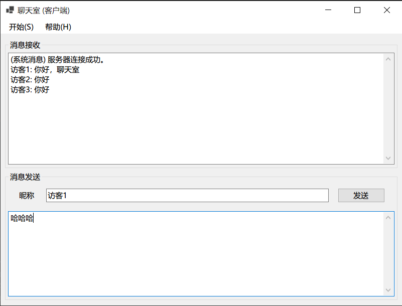

# ChatRoom

**一个基于 TCP Socket 的简单局域网聊天室程序**

## 项目简介

- **服务端部分：** 本项目服务端部分由 C 语言开发，CMake 构建，在 Linux 环境下运行。服务器采用多线程架构，即为每个客户端创建一个线程用于维持连接和通信。

- **客户端部分：** 本项目客户端部分由 .NET WinForms 技术开发，同样采用多线程架构，额外创建一个单独的线程用于实时接收消息。

## 效果展示

